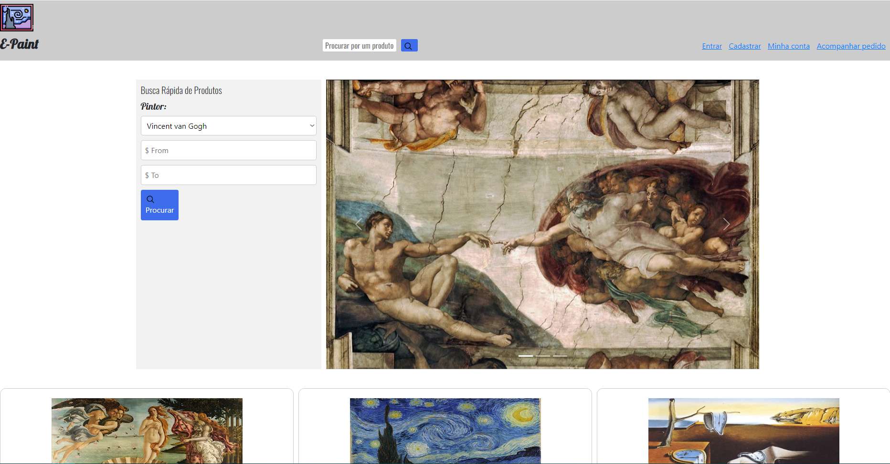

# Trabalho-Diw

Trabalho da Faculdade. Matéria: DESENVOLVIMENTO DE INTERFACES WEB

Portal de eCommerce



## Live link:

https://matheuscamp.github.io/Trabalho-Diw/

## Technologies used

- JavaScript
- HTML
- CSS

## Instructions to run:

1. Clone the project:

```
git clone https://matheuscamp.github.io/Trabalho-Diw/
```

2. After clone open the folder:

```
Trabalho-Diw
```

3. Open the index file with browser:

```
index.html
```
